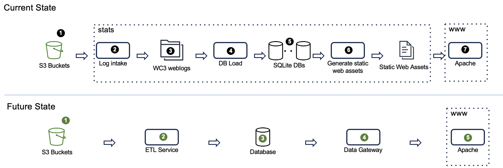

# Design Brief: stats.bioconductor.org replacement

Author: Robert Shear rshear@ds.dfci.harvard.edu
Date: 2023-10-03
Version: rev 1

## Change log
### rev 2
- 04-Oct-2023
- The "Current State:Static Web Assets" section spoke of 9 content types. There are 8 content types. The `<package_type>_pkg_scores.tab` example [https://bioconductor.org/packages/stats/bioc/bioc_pkg_scores.tab](https://bioconductor.org/packages/stats/bioc/bioc_pkg_scores.tab) appeared twice in the example table.

### rev 1
- 03-Oct-2023
- Added coding language information (markdown+html+javascript) to section [[#Server www.bioconductor.org]]
- Resolved Future State S3 design issues
- Current state description of paths to content with links to examples added 
- Publishing to www elaborated
- Future state architecture now simply Python data-aware pages.
- Future state Glue issues resolved
- Additional Future State considerations will be determined during development

## Initial draft
- 21-Sep-2023

# Overview


# Current State
## Repo
- https://github.com/Bioconductor/download_stats
## Service: S3 Bucket
- The only S3 bucket that is currently active with respect to the stats process is 
```
s3://bioc-cloudfront-logs
```

- Each object is a gz-compressed W3C Extended Web Log file. The recent files are generated by www CloudFront distribution. The provenance of the early files, which go back as far as 2013, are unknown, but assumed to have the same format as the current files.
- There is no prefix to the objects, i.e., all objects are at the top level with names as seen in the specimen s3 object name below. The code `E1...V3` designates the log source. The `0129f869` is a hash to assure object uniqueness. 
```
s3://bioc-cloudfront-logs/E1TVLJONPTUXV3.2023-09-17-00.0129f869.gz
```
`` 
- Objects are destroyed when 6 months old. They are all assigned to the Standard storage class. The object count is ~61k and the bucket size is ~33 GB.
## Server: stats.bioconductor.org

### Process: Log Intake
- Copy logs verbatim from S3 bucket to EBS volume
- Python script: `get_s3_logs.py`, repo `Bioconductor/download_stats`
- Runs weekly Sunday 20:00 local time

### Data: WC3 Web Logs
- Space used: 359 GB
- Location `/home/biocadmin/bioc-access-logs/s3/YYYY-MM-DD/E1TVLJONPTUXV3.YYYY-MM-DD-HH.0129f869.gz`
- Date range: 2013-08-28 - 2023-09-18
- Specimen file name: `E1TVLJONPTUXV3.2023-09-17-00.0129f869.gz`
### Process: Database Load
- Transforms logs from syslog files to rows in sqlite database
	- Log line-per-row, various column level transformations
- Python script: `get_s3_logs.py`, repo `Bioconductor/download_stats`
- Runs weekly Sunday 22:00 local time
### Data: SQLite DBs
- Space used 67 GB
- Directory: `/home/biocadmin/download_dbs/`
- One file for each year: format `download_db_YYYY.sqlite` , e.g.: `download_db_2023.sqlite`
- Range of files: 2009 through 2023
### Process: Generate Static Web Assets
- Creates static html assets that are surfaced by www.bioconductor.org Apache2 server
- Produced for one topic at a time, weekly. For each topic, there are two scripts, `extractDownloadStats-for-xxx.py` and `makeDownloadStatsHTML-for-xxx.py`, where `xxx` is given in the table below. 

| Topic               | When            | Code            |
| ------------------- | --------------- | --------------- |
| software packages   | Monday 12:00    | bioc            |
| annotation packages | Wednesday 15:00 | data-annotation |
| experiment packages | Friday 03:00    | data-experiment |
| workflows packages   | Saturday 15:00  | workflows                |


### Data: Static Web Assets (.html,  .txt, .tab)
On stats.bioconductor.org. the web content are stored under directory `/home/biocadmin/public_html/stats/`. When published to master.bioconductor.org, they are stored under `/extra/www/bioc/packages/stats`.


The files are organized hierarchically with the keys as shown below.

| Level | Keys                                    | Example                          |
| ----- | --------------------------------------- | -------------------------------- |
| 0     |                                         | Aggregate measures |
| 1     | `package_type`                          | `bioc`                           |
| 2     | `package_type`, `package_name` | `bioc, S4Vectors`                                 |
| 3     | `package_type`, `package_name`,  `year` | `bioc, S4Vectors, 2023`                                 |

The legal values for `package_type` in are `bioc`, `data-annotation`,` data-experiment`, and `workflows`.

There are 8 content types, 3 of which are HTML documents, the remainder being text files. Specimens of these files can be retrieved by following the links in the table below.

|                                                                                                                            |                          |
|:-------------------------------------------------------------------------------------------------------------------------- |:------------------------ |
| [ROOT](https://bioconductor.org/packages/stats/)                                                                           | index.html               |
| [bioc/](https://bioconductor.org/packages/stats/bioc/)                                                                     | index.html               |
| [bioc/bioc_packages.txt](https://bioconductor.org/packages/stats/bioc/bioc_packages.txt)                                   | bioc_packages.txt        |
| [bioc/bioc_pkg_scores.tab](https://bioconductor.org/packages/stats/bioc/bioc_pkg_scores.tab)                               | bioc_pkg_scores.tab      |
| [bioc/bioc_pkg_stats.tab](https://bioconductor.org/packages/stats/bioc/bioc_pkg_stats.tab)                                 | bioc_pkg_stats.tab       |
| [bioc/S4Vectors/](https://bioconductor.org/packages/stats/bioc/S4Vectors/)                                                 | index.html               |
| [bioc/S4Vectors/S4Vectors_2023_stats.tab](https://bioconductor.org/packages/stats/bioc/S4Vectors/S4Vectors_2023_stats.tab) | S4Vectors_2023_stats.tab |
| [bioc/S4Vectors/S4Vectors_stats.tab](https://bioconductor.org/packages/stats/bioc/S4Vectors/S4Vectors_stats.tab)           | S4Vectors_stats.tab      |

## Server: www.bioconductor.org
- Apache2 Server
# Future State

## Service: S3 Bucket

### Recovering history
The object retention time in the current bucket is 183 days. However the EBS files in the `/home/biocadmin/bioc-access-logs/s3` directory go back to 2013. These files should be returned to the S3 bucket. S3 storage is archival durability, while EBS storage is not. In addition, S3 storage is less expensive than EBS storage. Furthermore, there are less expensive storage S3 storage classes that are appropriate for this use case.
### Data privacy
The source IP addresses in the weblog records are subject to privacy requirements in GDPR jurisdictions as well as elsewhere. We should encrypt the source IP addresses with a strong, secret asymmetrical key. This will allow us to continue to count unique IP addresses, while securing the identity of the user.
### Partition Projection 
When an S3 bucket is the source for an Athena query, the strategy is to scan the entire bucket (or prefix). This is barely satisfactory in the current state, with 6 months of history. Once the log history has been returned to S3, it would make date-range limited inquires intractable. 

Athena has the capability of extracting information from the object path and mapping it to database columns. This is known as a partition projection. Specifically, we propose to add a path prefix comprised of the CloudFront distribution ID (for other weblog sources, an alternative unique identifier) followed by the date. So, the file `E1TVLJONPTUXV3.2021-12-26-HH.0129f869.gz` will have an S3 URI like this:

```
s3://bucket_name/E1TVLJONPTUXV3/2021-12-26/`E1TVLJONPTUXV3.2021-12-26-HH.0129f869.gz
```

More information may be found at [Setting up partition projection](https://docs.aws.amazon.com/athena/latest/ug/partition-projection-setting-up.html). Details on mapping the URI structure to columns may be found in in the document [Specifying custom S3 storage locations](https://docs.aws.amazon.com/athena/latest/ug/partition-projection-setting-up.html#partition-projection-specifying-custom-s3-storage-locations).

#### Implementation

Before commencing the data migration, the performance characteristics of this partition projection should be verified.

The current CloudFront-to-S3 process will require modification to attach the appropriate prefix to each object.
### Data Migration

A new bucket will be established for the weblogs, using the new production account number. The log stream with the new format should be activated and a final synchronization with the old S3 bucket effected.
Due to the file structure of the current state log files, the migration from the current state `stats` server can be migrated with an `rsync` command. 
## Service: ETL
## AWS Glue
The AWS Glue service provides ETL (extract-transform-load) capabilities.  Loading transformed weblogs into a relational database is a central use case for Glue.

Athena is an AWS service based on the Trino (formerly PrestoSQL) open-source distributed SQL query engine. It mediates the consumption of the weblogs and the loading of transformed results into other database systems. The data transformation rules in the Current State Python ETL code will be converted to SQL.

Note. In 2021, Martin Morgan developed an Athena based system for analyzing our weblogs directly from S3. The source code can be found at https://github.com/Bioconductor/AthenaLogs.

## Service: Relational Database
- AWS Aurora PostgreSQL
## Service: Data Gateway
- The data gateway will be a Python function run within the AWS Lambda service that will consume http GET URLs and return the appropriate text or HTML document. The Python function will be a composition of the Current State Python code.
## Server: \www.bioconductor.org
All HTTP requests to `https://bioconductor.org/packages/stats/` will be routed to a new Python application that will decode the URI path and produce a bit-for-bit perfect replica of the current output.

This program will tentatively use the `Flask` framework.
# Additional Considerations

The following topics will be determined during development.
- Roles
- Tags
- Test Instance
- System Management 
	- Terraform
	- Ansible
- CloudWatch Alerts and Metrics
