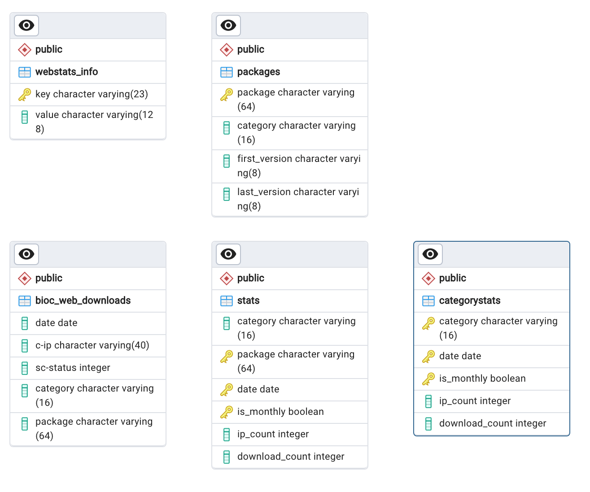

# `webstats` System Overview

Author: Robert Shear rshear@ds.dfci.harvard.edu
Date: 2024-09-25

This document provides a high level overview of the operation of the `bioc-webstats` system. It is current as of version `0.1.9`.

The purpose of `bioc-webstats` is to maintain a permanent record of the number of downloads for each Bioconductor package and to report this information on `www.bioconductor.org`. It contains records from 01-Jan-2009 through the present.

# Database Structure

# Parameters

## Paramater Names and Default Valuses

| Name              | FlaskName     | Default alue                   | Description              |
| ----------------- | ------------- | ------------------------------ | ------------------------ |
| db/dbname         | DBNAME        | webstats                       | Postgres database name, default 'webstats'                   |
| db/credentials    | DBCREDENTIALS | arn:aws:secretsmanager:reference-to-database-credentials-secret | arn of secrets manager secret                                |
| db/dbuser         | DBUSER        | webstats_runner                | PostgrSQL user name, default 'webstats_runner'               |
| db/port           | DBPORT        | 5432                           | Server endpoint port number |
| db/server         | DBSERVER      | None                           | The symbolic address of the endpoint for the Postgres server |
| flask/flask_app   | APP           | bioc_webstats. app:create_app('development')                    | Default initiation call for Flask                            |
| flask/approot     | APPROOT       | /var/www/webstats              | Working directory for app   |
| flask/logroot     | LOGROOT       | /var/log/bioc-webstats         | Location of log files for the app   |
| flask/osgroup     | OSGROUP       | webstats                       | Execution group name        |
| flask/osuser      | OSUSER        | webstats                       | Execution user name         |
| flask/flask_debug | DEBUG         | FALSE                          | False' Caution: Do not enable in production  |
| flask/log_level   | LOG_LEVEL     | INFO                           | Standard log levels, default 'INFO'  |
| flask/secret_key  | SECRET_KEY    | None                           | Secret key for activating web client flask debugging tools |

