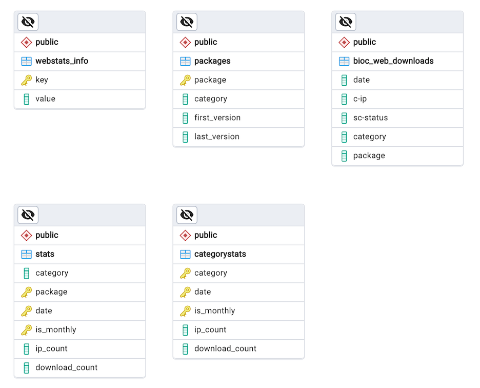

# `webstats` System Overview

Author: Robert Shear rshear@ds.dfci.harvard.edu
Date: 2024-09-25

This document provides a high level overview of the operation of the `bioc-webstats` system. It is current as of version `0.1.9`.

The purpose of bioc-webstats is to maintain a permanent record of the download counts for each Bioconductor package in an SQL database and to report this information on www.bioconductor.org. It includes records from January 1, 2009, to the present.

This application replaces the "stats server" application. That server produced static pages for all the content under `www.bioconductor.org/packages/stats/`. The `bio-webstats` appliation, in its initial implementation, is designed to match the eact form of the application that it replaces.

The `bioc-webstats  application is implementd as in Python application and supported by a SQL database. It has two major functions.

1. Data ingestion. Consume web traffic logs in Common Log Format (CLF), select those records which are package downloads, store them in a SQL table, and maintain summary statistics for each package.
2. Web reporting. The application can serve as a backend to any web server that supports the `WSGI` standard. It consumes `http get` requests, infers their semantics from the the `URI` stem, and returns content that is functionally the same as the system it replaces. In the case of `html` responses, this means that both the content as well as the look and feel are the same. Other responses are unformatted text downloags (`.tab` and `.txt`), which are byte-for-byte idenitcal to the prior system.

## Technical Stack

The application implmenetation is based on several frameworks and libraries:

- Python 3.12
- [Poetry](https://python-poetry.org) - Dependency management and padckaging.
- [Flask](https://flask.palletsprojects.com) - Web application framework.
- [SQLAlchemy](https://www.sqlalchemy.org) -  Pythn SQL toolkit and bject-rlational mapper.
- [Chart.js](https://www.chartjs.org/) - JavaScript charting library.
- [Bootstrap 5](https://getbootstrap.com) - Responsive JavaScript frontend toolkit.

There are various additional Python and JavaScript dependencies that support the application. See `pyproject.toml` in the project root directory for details.

The application is distibuted as a `whl` file and can be installed by any installation and package manager, including `poetry`, `pipenv`, `pipx`, `virtualenv`, or `conda`.

## General System Flow

The general system flow as deployed as of this writing is depicted figure 1 below. The Python application can be run on any server that has secure access to `master.biconductor.org` and the AWS `Athena` service that can read the CloudFront CLF logs. This includes `master.biocnductor.org` itself. Other components, including the SQL Server, and the interal web server, are easily replaced. 

Not depicted in the stack are AWS-specific features for configuration (the AWS Systems Manager Parameter Store) and security (the AWS Security Manager).

Note: The direction of each line indicates the functional flow of information. That is, for every request-response pattern, the arrow points to the consumer of the response.

  <em>Figure 1: General System Flow.</em>

A. A [Waitress](https://pypi.org/project/waitress/) lightweight webserver that consumes incoming `http get` requests from and returns results to an upstream webserver (arrow 3).

B. A cron job that runs daily at 01:00 UTC that:
- Detects detects changes in the development version of the manifest (arrow 1).
- Invokes an AWS Athena View to return all CloudFront log entries for dates newer than those previously uploaded (arrow 2), but only if they have a URI stem that implies a download, and only if the package name is valid.
- Updates the summary tables, `stats` and `categorystats` (see Database Structure below).

C. A SQL Database server. Currently implemented as a serverless AWS RDS instance, Postgres 15.

# Database Structure

# Configuration

## Development Configuratiion

## Production Configuration

## Paramater Names and Default Valuses

| Name              | FlaskName     | Default alue                   | Description              |
| ----------------- | ------------- | ------------------------------ | ------------------------ |
| db/dbname         | DBNAME        | webstats                       | Postgres database name, default 'webstats'                   |
| db/credentials    | DBCREDENTIALS | arn:aws:secretsmanager:reference-to-database-credentials-secret | arn of secrets manager secret                                |
| db/dbuser         | DBUSER        | webstats_runner                | PostgrSQL user name, default 'webstats_runner'               |
| db/port           | DBPORT        | 5432                           | Server endpoint port number |
| db/server         | DBSERVER      | None                           | The symbolic address of the endpoint for the Postgres server |
| flask/flask_app   | APP           | bioc_webstats. app:create_app('development')                    | Default initiation call for Flask                            |
| flask/approot     | APPROOT       | /var/www/webstats              | Working directory for app   |
| flask/logroot     | LOGROOT       | /var/log/bioc-webstats         | Location of log files for the app   |
| flask/osgroup     | OSGROUP       | webstats                       | Execution group name        |
| flask/osuser      | OSUSER        | webstats                       | Execution user name         |
| flask/flask_debug | DEBUG         | FALSE                          | False' Caution: Do not enable in production  |
| flask/log_level   | LOG_LEVEL     | INFO                           | Standard log levels, default 'INFO'  |
| flask/secret_key  | SECRET_KEY    | None                           | Secret key for activating web client flask debugging tools |

# Deploymnet

TODO

# Web Application Internals OVerview

The platofrm independent logic for the system is in the directory `./bioc_stats`.

## Initialization

The application is always initialized by invoking `bioc_webstats.app`.

TODO

## Processing a `http get`

1. `stats.py`

2. `models.py`

3. `templates/stats-bioc.html`

